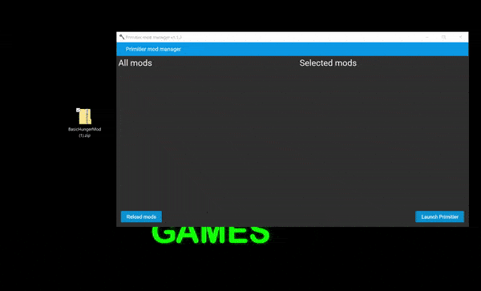

# Primitier mod manager v2

Primitier mod manager is a tool to easily install mods for Primitier.

**Updated for Primitier V2.0.2 (IL2CPP) with MelonLoader v0.7.2**



## Requirements

- **.NET 8.0 Desktop Runtime** (x64) — [Download here](https://dotnet.microsoft.com/en-us/download/dotnet/8.0)
- **MelonLoader v0.7.2+** (auto-installed by the manager) requires .NET 6.0+ Desktop Runtime

## Download

Download the latest build from [Releases](https://github.com/kirilllolik23/PrimitierModManager/releases).

## Usage

1. Launch **PrimitierModManager.exe**
2. Drag and drop `Primitier.exe` onto the setup window
3. Drag `.pmfm` or `.zip` mod files onto the main window
4. Click the arrow to move mods to "Selected mods"
5. Click **Launch Primitier**

## Building from source

```bash
dotnet restore
dotnet build
dotnet publish -c Release -r win-x64 --self-contained false -o publish
```
